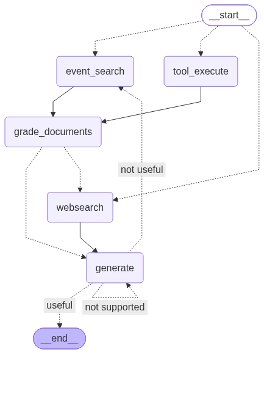

# Streaming Sports Intelligence Agent

A streaming sports intelligence agent that ingests live-style sports events through a Kafka-like pipeline, stores them for both structured queries and semantic retrieval, and uses a LangGraph agent with tool calling and RAG to generate evidence-grounded match analysis.

Built with **Kafka** (mock in-process), **LangChain**, **LangGraph**, **Chroma**, **SQLite**, **OpenAI**, and **Streamlit**.

## Architecture



```
Mock sports event producer
        |
In-Process Mock Kafka (queue.Queue)
        |
Kafka consumer
        |
Event cleaner / normaliser
        |
+------------------------------+
|  SQLite event store          |  <-- structured queries (timeline, stats, summary)
|  Chroma vector store         |  <-- semantic retrieval (narrative search)
+------------------------------+
        |
LangGraph agent
  route -> tools/retrieve -> grade -> generate -> hallucination check -> answer check
        |
Streamlit UI with live event feed + analyst chat
```

### Agent Flow

```
User Question
     |
  [Router] -- decides: tools / vectorstore / websearch
     |
  [Tool Execute]     [Event Search]     [Web Search]
     |                    |                  |
  [Grade Documents] <----+------------------+
     |
  [Generate] -- sports analyst prompt with evidence
     |
  [Hallucination Check] -- is it grounded in the data?
     |
  [Answer Check] -- does it address the question?
     |
  Answer + Sources
```

## Tech Stack

| Component | Technology |
|-----------|-----------|
| Event streaming | Mock Kafka (Python `queue.Queue`, swappable for Confluent) |
| Event storage | SQLite (structured queries) |
| Vector store | Chroma (semantic retrieval via OpenAI embeddings) |
| Agent framework | LangGraph (state machine with routing, tool calling, quality loop) |
| LLM | OpenAI gpt-4o-mini |
| Tools | LangChain `@tool` (timeline, player stats, match summary, event search) |
| Quality control | Retrieval grading, hallucination detection, answer grading |
| Web fallback | Tavily Search |
| UI | Streamlit |
| Data models | Pydantic v2 |

## Setup

### Prerequisites

- Python 3.12+
- [uv](https://docs.astral.sh/uv/) package manager
- OpenAI API key
- Tavily API key (optional, for web search fallback)

### Install

```bash
git clone <repo-url>
cd agentic-rag
uv sync
```

### Environment

Create a `.env` file in the project root:

```
OPENAI_API_KEY=sk-...
TAVILY_API_KEY=tvly-...   # optional
```

## Running

### Streamlit UI (recommended)

```bash
streamlit run app.py
```

Then:
1. Select a match fixture from the sidebar
2. Choose **Batch** (instant) or **Real-time** (events stream in with delays)
3. Click **Start Match**
4. Switch to the **Ask the Analyst** tab
5. Ask questions about the match

### CLI

```bash
python main.py
```

Runs three sample questions against the fixture match and prints the agent's analysis.

## Example Questions

- "Summarise the match"
- "What changed after the red card?"
- "Which player had the biggest impact?"
- "What happened between minute 60 and 80?"
- "What are the key talking points?"
- "How did Saka play?"
- "Describe the build-up to the equaliser"
- "Generate a post-match analyst brief"

## Project Structure

```
.
├── app.py                      # Streamlit UI
├── main.py                     # CLI entry point
├── pyproject.toml              # Project config and dependencies
├── models/
│   └── events.py               # Pydantic data models (Player, MatchEvent, MatchFeed, etc.)
├── fixtures/
│   ├── __init__.py             # Fixture loader
│   └── match_001.json          # Arsenal 2-1 Man City (36 events, all types)
├── streaming/
│   ├── mock_kafka.py           # In-process mock Kafka (TopicRegistry, MockProducer, MockConsumer)
│   ├── producer.py             # Match event producer (batch + real-time modes)
│   ├── consumer.py             # Event consumer (yields typed MatchEvent objects)
│   └── pipeline.py             # Ingestion pipeline (consumer -> SQLite + Chroma)
├── storage/
│   ├── event_store.py          # SQLite event store (structured queries)
│   └── vector_store.py         # Chroma vector store (semantic retrieval)
├── graph/
│   ├── state.py                # Graph state (question, match_id, generation, sources, etc.)
│   ├── consts.py               # Node name constants
│   ├── graph.py                # LangGraph state machine
│   ├── chains/
│   │   ├── router.py           # Question router (tools / vectorstore / websearch)
│   │   ├── generation.py       # Sports analyst generation chain
│   │   ├── retrieval_grader.py # Document relevance grader
│   │   ├── hallucination_grader.py # Hallucination detector
│   │   └── answer_grader.py    # Answer quality grader
│   ├── nodes/
│   │   ├── tool_execute.py     # LLM-driven tool calling node
│   │   ├── event_search.py     # Semantic search node
│   │   ├── retrieve.py         # Vector retrieval node
│   │   ├── grade_documents.py  # Document grading node
│   │   ├── generate.py         # Generation node
│   │   └── web_search.py       # Web search fallback node
│   └── tools/
│       ├── registry.py         # Store dependency injection
│       ├── timeline_tool.py    # Get events in a minute range
│       ├── player_stats_tool.py# Aggregate player statistics
│       ├── match_summary_tool.py# Match overview (score, cards, subs, lineups)
│       └── event_search_tool.py# Semantic event search
└── tests/
    ├── test_models.py          # Data model tests (17 tests)
    ├── test_streaming.py       # Mock Kafka tests (17 tests)
    ├── test_event_store.py     # SQLite store tests (28 tests)
    ├── test_vector_store.py    # Chroma store tests (11 tests)
    ├── test_pipeline.py        # Ingestion pipeline tests (9 tests)
    ├── test_tools.py           # Tool tests (14 tests)
    └── test_graph.py           # Integration tests (5 tests)
```

## Testing

```bash
# Run all tests
pytest -v

# Run only unit tests (no API calls needed)
pytest tests/test_models.py tests/test_streaming.py tests/test_event_store.py -v

# Run tests that require OpenAI API
pytest tests/test_vector_store.py tests/test_pipeline.py tests/test_tools.py tests/test_graph.py -v

# Run chain tests
pytest graph/chains/tests/ -v
```

## Design Decisions

- **In-process mock Kafka**: Uses `queue.Queue` to simulate Kafka topics. The `MockProducer`/`MockConsumer` API mirrors Confluent's client — swap for `confluent_kafka` when moving to a real broker.
- **Dual storage**: SQLite for structured queries (timeline, stats, summary) and Chroma for semantic retrieval. This gives the agent both precise tool-based access and fuzzy narrative search.
- **Quality loop**: Every generation goes through hallucination checking and answer grading. If grounding fails, it re-generates. If the answer doesn't address the question, it tries a different retrieval path. Max 3 retries to prevent infinite loops.
- **Sport-agnostic models**: The `EventType` enum and `MatchEvent` schema are designed to be extended for other sports (NFL, basketball) by adding new event types and using the `additional_info` dict for sport-specific data.
- **Tool calling via LLM**: The `tool_execute` node uses the LLM with bound tools to decide which tools to call, rather than hardcoding routing logic. This makes the system naturally extensible — add a new tool and the LLM can discover it.

## Future Enhancements

- **Real Kafka broker**: Replace mock with Confluent Kafka via Docker Compose
- **NFL events**: Add NFL-specific event types and fixture data
- **Real-time data feeds**: Connect to live sports data APIs
- **Persistent storage**: Move SQLite to PostgreSQL, Chroma to a hosted instance
- **LangSmith tracing**: Add observability for agent runs
- **Multi-match analysis**: Compare events across matches for the same team/player
